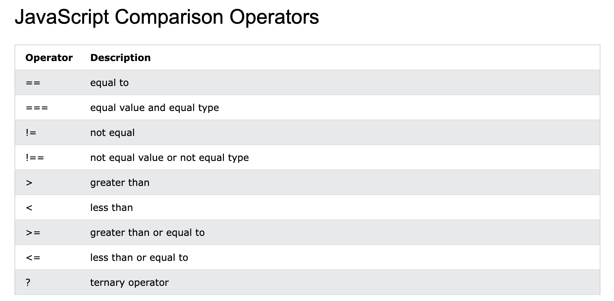

Starting with thee basics. Javascript is a scripting language. It adds dynamism to a web page or so I have gathered but  potentially I will check and come back again once I feel I am getting better and see if  this is what I still feel at that time.

I am using [The Odin Project](https://www.theodinproject.com/paths/foundations/courses/foundations#javascript-basics)[^Odin-project] for this and feels its really nice and interactive and provides great online resources. Made up my mind to  make this into a GitHub page as when I need to revise aI often struggle to  find my paper notes and there is too much clutter now in my online cloud folders that I often struggle to dig out whats where. I hope to keep coming back to check this and update this every now and then and potentially will  be able to give up my dependence on other tools and stop  losing my important learning tools. Hopefully, will develop a flashcard like learning tools for revision and I guess others can benefit from this too.

[^Odin-project]:https://www.theodinproject.com/paths/foundations/courses/foundations#javascript-basics

I love [MDN docs](https://developer.mozilla.org/en-US/docs/Learn_web_development/Getting_started/Your_first_website/Adding_interactivity) and they provide a great free resource for learning almost everything HTML, CSS and JS. Will be referencing there  JS resource.[^MDN_JS]

[^MDN_JS]: https://developer.mozilla.org/en-US/docs/Learn_web_development/Getting_started/Your_first_website/Adding_interactivity

Also, came across a website Learning X in Y minutes on The Odin Project[^Odin-project] which I will be going  through and adding any notes from there if I find them useful.[^LXY]

[^LXY]: https://learnxinyminutes.com/javascript/

Found this on Odin project about JQuery.

> JQuery not included on Odin Project as it's use cases have gone down. It was easier for DOM manipulation  and AJAX calls but not  the case anymore. If I still want to learn then can use [jQuery Documentation](https://jquery.com/)

>Pearls:
> - You can run Javascript in browser
> - Use the VS Code snippet **`!` + `TAB`** to create the basic HTML skeleton.

How to use JavaScript.
- Include script tag in the HTML page

```html
<script>
    // Your JavaScript goes here!
    console.log("Hello, World!")
  </script>
```

<p style="text-align:center;"><strong>OR</strong></p>

Include JavaScript in a webpage through an external script. This is very similar to linking external CSS docs to your website.

```html
<script src="javascript.js"></script>
```


## Variables

You can declare variables using the `let` keyword.

```javascript
let name = "John";
let surname = "Doe";

console.log(name);
console.log(surname);
```


- const can also be used to declare variables.
- var is the third way which was original way of declaring variables but is not used anymore.

##### Difference between let and const.

- `let`,  be re-assigned.
- `const`,  **can’t** re-assign and will throw an error if we try.

- Numbers can be declared using let but make sure not to use quotes around them or they will be treated as strings. Also, JS treats maths quite logically almost straight away with no additional changes needed. Potentially, worth reading about how these are prioritised when it comes to different arithmetic operations.

#### Comparison operators




Next topics covered in Odin project are about installing node which I already have on my system. I use `n` to install it so you can check if that makes sense to you but you can use lots of methods.


[JavaScript methods](https://www.w3schools.com/js/js_string_methods.asp)[^methods]

[^methods]: https://www.w3schools.com/js/js_string_methods.asp


8 Data types in [Javascript](https://javascript.info/types)[^data_types]

[^data_types]: https://javascript.info/types

## Basic String Methods

Javascript strings are primitive and immutable: All string methods produce a new string without altering the original string.


Useful reference from [MDN Web]( https://developer.mozilla.org/en-US/docs/Web/JavaScript/Reference/Global_Objects/String) Docs for strings[^MDN_web_docs_strings]

[^MDN_web_docs_strings]: https://developer.mozilla.org/en-US/docs/Web/JavaScript/Reference/Global_Objects/String

